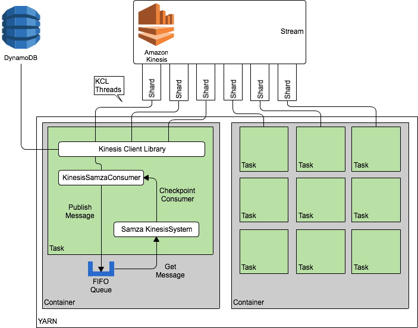

Kinesis Samza
===========

Kinesis Samza provides a connector architecture to allow Samza processing to be run against Amazon Kinesis. This connector makes the use of Kinesis Streams transparent to the Samza application, allowing for low friction migration between Apache Kafka and Amazon Kinesis.

# Architecture

The Kinesis Samza connector integration architecture can be seen above. We continue to use YARN to run Samza Containers, which create a fixed number of Samza KinesisSystem based tasks. Each of these tasks uses the Amazon Kinesis Client Library https://github.com/awslabs/amazon-kinesis-client to access one or more Kinesis Shards. A Kinesis Record Processor pushes the Kinesis Events to the enclosing container in the IRecordProcess.processRecords method, and the Yarn Container persists these messages in a queue for subsequent delivery to Samza processing. When the Samza application completes processing, the Container checkpoints the latest record processed per Shard via the KCL application.

## Caveats

Samza and Kafka are designed to work with a fixed number of Kafka partitions over the life of the Stream, and allocate a single Samza task per partition. Because Kinesis has an elastic and virtually unlimited number of Shards (which resemble Kafka partitions in some ways), if the Kinesis Stream is resharded at any point then a task may be delivered messages from different Shards. It is also possible that responsbility for a Shard could be transferred to another Samza task at any time. Because of this transfer capability, Samza tasks must not store state locally in process, as the partition keys which map to a container can change at any time. Instead, consider offloading state management tasks to an external datastore which can accomodate the message volume required.
